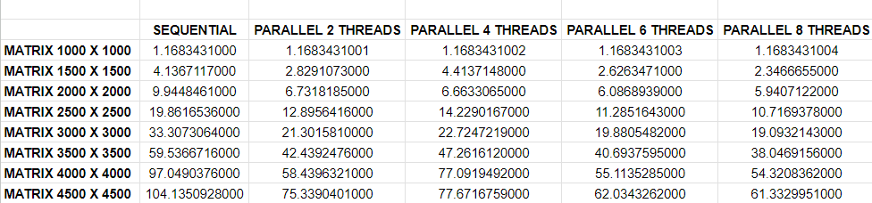

# PARALLEL LINEAR EQUATIONS

### **OVERVIEW**

Parallel computing using OpenMP to solve linear equation systems of the form Ax=b. The algorithm leverages the Gauss elimination method combined with backpropagation.

### **LINEAR EQUATION SYSTEM**

The linear equation system represented by Ax = b is solved in the code using the Gaussian elimination method. The goal is to transform matrix A into an upper triangular matrix, which simplifies the system's resolution. The Gaussian elimination method consists of the following steps:

### **ELIMINATION PHASE**

In this phase, matrix A is transformed into an upper triangular matrix. This is done by eliminating the coefficients below the main diagonal. Matrix A and vector b are modified during this process.

`A` Iteration over the rows of matrix A:
The program starts from the first row and goes through to the penultimate row, n - 1, where n is the dimension of the matrix.

`B` For each current row, the program does the following:
Calculates a temporary scaling factor to make the element below the main diagonal equal to zero. This factor is obtained by dividing the current element in the row below the main diagonal by the diagonal element of the current row.
Subtracts the current row, multiplied by the temporary factor, from the subsequent rows to make the elements below the main diagonal equal to zero.
Applies the same operation to vector b to maintain consistency.

### **BACK SUBSTITUTION PHASE**

After matrix A has been transformed into an upper triangular matrix, the program performs back substitution to find the solutions to the system of equations.

`A` Starting from the last row, n - 1, the program calculates the value of x corresponding to that row.

`B` The program works from the bottom up, finding the values of x for the previous rows. This is done using the x values already calculated for the later rows.

`C` The value of x for the current row is calculated by dividing the current value in the vector b by the main diagonal entry of the corresponding row in matrix A. In other words, the value of x is equal to the value in b divided by the diagonal value in A.

The result is a vector x that contains the solutions to the system of equations.

### **SOLUTIONS ANALYSIS**

Tests were conducted for random values in square matrices as shown in the table.

The values presented are expressed in time units, measured in seconds. It is observed that the benefits of parallelization become more evident as the size of the matrix increases, becoming increasingly significant. It is also noted that while parallelization introduces some overhead due to task coordination between threads, this cost is largely offset by the substantial speed gain provided by task division and simultaneous execution of operations, particularly with larger dimensions of matrix A. The results highlight the effectiveness of the parallel approach for optimization in a problem that involves intensive calculations.

The tests were conducted on the Windows Subsystem for Linux (WSL) on a Windows machine. Better results can be obtained in native system environments due to optimization and more direct support for program execution.

### **AUTHORS**

- Giovane Hashinokuti Iwamoto - Computer Science student at UFMS - Brazil - MS
- Paulo Gustavo Hemmel Garcia - Computer Science student at UFMS - Brazil - MS

I am always open to receiving constructive criticism and suggestions for improvement in my developed code. I believe that feedback is an essential part of the learning and growth process, and I am eager to learn from others and make my code the best it can be. Whether it's a minor tweak or a major overhaul, I am willing to consider all suggestions and implement the changes that will benefit my code and its users.
